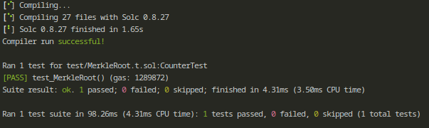

---

# Merkle-Based Whitelist Smart Contract

This project demonstrates how to implement a **Merkle-based whitelist** in a smart contract using **Solidity**. It allows users to verify if their address is part of a whitelist, which is stored off-chain and validated through a **Merkle proof**.

## Table of Contents
- [Introduction](#introduction)
- [Features](#features)
- [Technologies Used](#technologies-used)
- [Installation and Setup](#installation-and-setup)
- [Usage](#usage)
- [Running Tests](#running-tests)
- [Test Results](#test-results)
- [License](#license)

## Introduction
This project provides a **whitelist smart contract** that verifies user addresses using a **Merkle tree**. The Merkle root, which summarizes the whitelist, is computed off-chain. Users can verify if they are part of the whitelist by submitting a **Merkle proof** to the smart contract.

## Features
- **Merkle root-based whitelist**: Verifies if an address is in the whitelist using Merkle proofs.
- **Efficient verification**: Uses Merkle tree structures to allow for scalable and efficient address verification.
- **Fully tested**: Includes test cases written in Solidity using **Foundry** to ensure the proper functioning of the whitelist logic.

## Technologies Used
- **Solidity 0.8.13+**: The smart contract is written in Solidity.
- **Foundry**: A Solidity testing framework that allows for fast and reliable contract tests.
- **Murky**: A utility for constructing and validating Merkle trees in Solidity.

## Installation and Setup

1. Clone the repository:
   ```bash
   git clone https://github.com/Dennis-DW/Merkle-Based-Whitelist-Smart-Contract.git
   ```
2. Change to the project directory:
   ```bash
   cd merkle-whitelist
   ```
3. Install dependencies using Foundry:
   ```bash
   forge install
   ```

4. Compile the smart contracts:
   ```bash
   forge build
   ```

## Usage

1. Deploy the smart contract with the **Merkle root** (calculated off-chain) as a constructor argument.

2. Use the `checkInWhitelist` function to verify if a user's address and mint allowance are part of the whitelist by submitting the appropriate **Merkle proof**.

## Running Tests

To run the tests:

1. Ensure the project is compiled:
   ```bash
   forge build
   ```

2. Run the tests:
   ```bash
   forge test
   ```

The test suite includes scenarios where valid and invalid addresses attempt to verify their inclusion in the whitelist.

## Test Results

Here’s the result from running the test suite:



> All tests passed successfully, indicating the whitelist logic works as expected.

## License
This project is licensed under the [MIT License](LICENSE).

---
